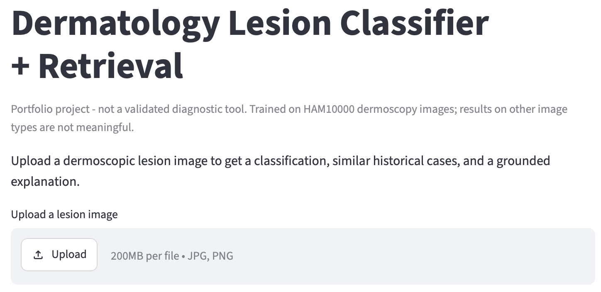
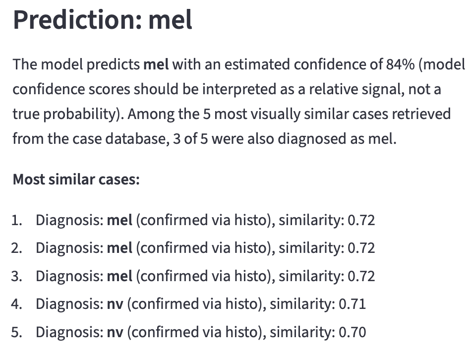

# Dermatology Lesion Classifier + Retrieval-Augmented Explanation

A skin lesion classifier (ResNet50 / ViT-B/16, trained on HAM10000)combined with a retrieval layer that surfaces visually similar historical cases, and a grounded explanation layer. Built to move beyond a bare classification label toward a grounded, evidence-backed explanation. All evaluation here is done via macro-averaged metrics and per-class breakdowns, computed on a *lesion-level* held-out test set.

---

## Demo

**Initial state:**



**After uploading a lesion image:**



*Streamlit demo showing a classification, calibrated confiedence, and a grounded explanation referencing retrieved similar cases from the training set. (Uploaded image panel omitted from the result screenshot - see [Setup](#setup) to run the app and see the full interface.)*

Run locally:
```bash
streamlit run app.py
```

---

## Repository Structure

```
derm-rag-classifier/
├── app.py                 # Streamlit demo
├── configs/
├── data/                  # gitignored - raw images, processed splits, 
├── docs/                  # README images from demo  
├── notebooks/             # EDA only
├── src/
│   ├── data/              # Dataset/DataLoader
│   ├── models/            # model factory, losses, training loop, evaluation, calibration
│   ├── retrieval/         # embeddings, FAISS index, similarity search
│   ├── explain/           # templated, grounded explanation generation
│   ├── utils/             # shared config loading
├── tests/                 # pytest - data integrity, model, retrieval, and explanation tests       
└── checkpoints/           # gitignored
```

---

## Setup

```bash
conda create -n derm-rag python=3.11
conda activate derm-rag
pip install pandas numpy matplotlib pillow scikit-learn pyyaml torch torchvision \
            faiss-cpu tqdm pytest jupyter ipykernel streamlit
```

Download HAM10000 and place it at:
```
data/raw/HAM10000_metadata.csv
data/raw/HAM10000_images_part_1/
data/raw/HAM10000_images_part_2/
```

```bash
python src/data/make_splits.py          # lesion-level train/val/test split
python src/models/train.py --config configs/resnet50_dropout.yaml
python src/models/train.py --config configs/vit_b_16_dropout.yaml
python src/models/fit_calibration.py    # temperature scaling
python src/retrieval/build_case_db.py   # embed training images
python src/retrieval/build_index.py     # build FAISS index
```

Run the demo:
```bash
streamlit run app.py
```

Run tests:
```bash
pytest tests/ -v
```

---

## 1 — Data: HAM10000

Dermoscopic images across 7 diagnostic classes. Full EDA in
`notebooks/01_eda_ham10000.ipynb`. Key findings that shaped every downstream decision:

| Finding | Implication |
|---|---|
| Severe class imbalance (~67% `nv`, ~1.1% `df`) | Accuracy is a misleading metric; macro F1 + per-class recall used instead; class-weighted loss applied |
| ~26% of lesions have multiple images | Splits done at the lesion level, not image level |
| `mel` vs. `nv` are visually hard to distinguish | Motivates the retrieval/explanation layers |
| Body site and age showed no strong class-discriminating pattern | Image-only modeling approach rather than multi-modal fusion |

**Split:** 70/15/15, stratified by class, split at the `lesion_id` level. Verified
programmatically (`tests/test_splits.py`) — zero lesion overlap between splits, all
classes present in every split, class proportions preserved within 5 percentage points.

---

## 2 — Classifier

### Architecture

Two backbones trained and compared under identical conditions (same splits, same
augmentation, same optimizer schedule) to isolate the effect of architecture choice:

- **ResNet50**, ImageNet-pretrained (`IMAGENET1K_V2` weights)
- **ViT-B/16**, ImageNet-pretrained (`IMAGENET1K_V1` weights)

### Transfer learning strategy: two-phase progressive unfreezing

- **Phase 1:** entire pretrained backbone frozen, only the new classification head trained.
- **Phase 2:** later layers unfrozen for fine-tuning at a 10x lower learning rate
  (ResNet: `layer3`+`layer4`+`fc`; ViT: last 4 of 12 encoder blocks + head).

Chosen over full fine-tuning to reduce the risk of catastrophic forgetting on a
dataset of this size. Note ResNet's partial split and ViT's are not equivalently conservative in practice,
despite both being "partial fine-tuning" by layer count. Documented rather than forced to match.
Regression-tested in `tests/test_model_factory.py` to guard against silently reintroducing an unfreeze-split bug.

### Class imbalance handling

Class-weighted cross-entropy loss (inverse-frequency weighting, computed from the
training set only). 

### Checkpoint selection

Best checkpoint saved by **validation macro F1**, with per-class `mel` recall tracked
alongside as a secondary, clinically-motivated metric.

### Experiment log

Rather than accept the first working configuration, the following changes were tested
in isolation against a fixed baseline (ResNet50, class-weighted loss, original
unfreeze split, no dropout) to understand what actually helped:

| Change tested | Result |
|---|---|
| Dropout (p=0.3) before final classification layer | Macro F1 improved, gains distributed across nearly all classes, no class regressed significantly |
| `mel`-specific decision threshold override (predict `mel` if P(mel) > threshold, regardless of argmax) | At threshold=0.3: **both** `mel` precision and recall improved simultaneously over plain argmax — not just a trade-off | 


### Final results (test set, lesion-level held-out)

| Model | Macro F1 | `mel` recall | `mel` precision |
|---|---|---|---|
| ResNet50 (dropout, threshold=0.3) | 0.71 | 0.71 | 0.56 |
| **ViT-B/16 (dropout, threshold=0.3)** | **0.79** | 0.72 | 0.44 |

ViT-B/16 outperformed ResNet50 on the overall macro F1 and on `mel` recall, despite
having a smaller fraction of its parameters unfrozen during fine-tuning.

**Limitation:** further tuning attempts beyond dropout consistently produced
either no improvement or regressions concentrated on rare/important classes — this
result is treated as a reasonable stopping point for this stage.

---

## 3 — Retrieval layer

### Design

- **Embeddings:** the 768-dimensional feature vector immediately preceding ViT-B/16's
  final classification layer. ViT was chosen as the embedding source since it
  was the stronger-performing classifier.
- **Vector store:** FAISS, `IndexFlatIP`. Embeddings are L2-normalized so inner product is equivalent to cosine
  similarity.
- **Case database:** built from the **training set only**. Documented limitation: since
  ViT was trained on these exact images, retrieved "historical cases" are images the
  model has already seen during training.

### Retrieval quality — validated, not assumed

Queried using held-out **test-set** images (never seen by the embedding model or the
case database), one query per class:

| Result | Finding |
|---|---|
| Top-1 diagnosis match | Correct for all 7 classes tested |
| Top-3 diagnosis match | Correct for all 7 classes tested |
| Top-5 diagnosis match (≥3 of 5 same diagnosis) | 6 of 7 classes — only `df` (rarest class, ~115 lesions) fell short, plausibly due to limited case-database coverage |

Notably, retrieval quality on `mel` — the classifier's weakest class — was strong,
suggesting retrieval can surface useful, mostly-correct context even where the
classifier's own single-label prediction is uncertain. This is the core empirical
justification for building a retrieval/explanation layer on top of an imperfect
classifier.

Regression-tested in `tests/test_retrieval.py`: case DB/index row-alignment integrity,
self-retrieval sanity check, and the per-class diagnosis-match-rate check above (asserted ≥70% of classes
must show ≥3/5 top-5 match).

---

## 4 — Explanation layer

### Design: templated

The explanation is assembled from a fixed structure filled with facts pulled directly from the classifier's output and the retrieved cases, so hallucination is structurally prevented. The template states: the predicted class and its calibrated confidence, how many of the retrieved cases share that diagnosis, and per-case detail for each retrieved case. 

Faithfulness is regression-tested in `tests/test_explain.py`: every diagnosis mentioned in generated text is checked againts the actual retrieved cases, and the stated agreement count is checked against a real count.

### Calibration

Raw softmax confidence scores from neural networks can be overconfident, including on incorrect predictions. Temperature scaling (Guo et al., 2017) was applied post-hoc: a single scalar `T`, fit on the validation set via NLL minimization, divides the classifier's logits before softmax.

It does not change the predicted class, only the reported confidence.

---

## 5 — Deployment

A local Streamlit demo (`app.py`) wires the full pipeline together: image upload -> classification (calibrated) -> retrieval -> templated explanation, displayed together.
Models and the retrieval inde are loaded once and cached.

**Scope note:** the demo currently runs locally only.

---

## Limitations

- HAM10000 is not demographically representative — performance on darker skin tones
  is untested and likely worse; this is a real, unaddressed limitation of the current
  model.
- `dx_type` confirmation method varies across the dataset (histopathology vs.
  follow-up vs. consensus) — the model does not distinguish confidence level by
  ground-truth source.
- This is a portfolio/research project, not a validated clinical tool, and is not
  intended for diagnostic use.

  ## References

  - Tschandl, Philipp. 2018. “The HAM10000 Dataset, a Large Collection of Multi-Source Dermatoscopic Images of Common Pigmented Skin Lesions.” Harvard Dataverse. https://doi.org/10.7910/DVN/DBW86T.
  Data used under [CC BY-NC 4.0]

  - Guo, Chuan, Geoff Pleiss, Yu Sun, and Kilian Q. Weinberger. "On calibration of modern neural networks." In International conference on machine learning, pp. 1321-1330. PMLR, 2017.
